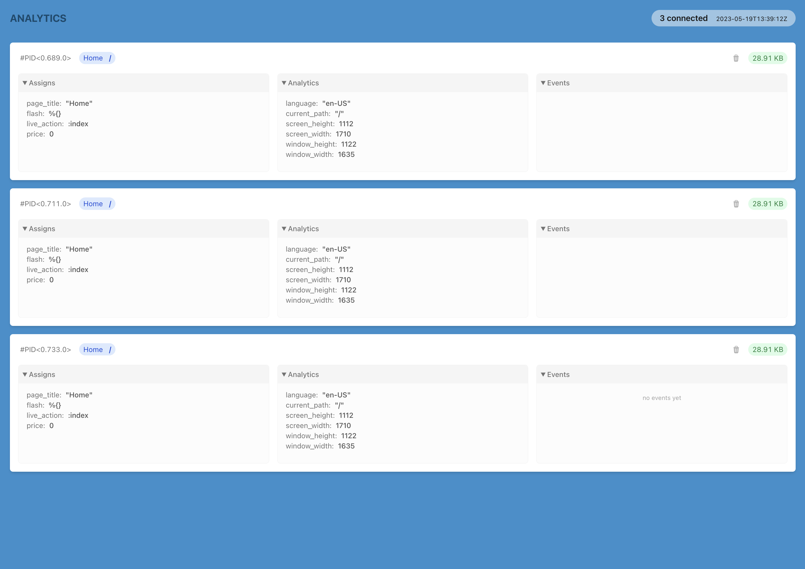
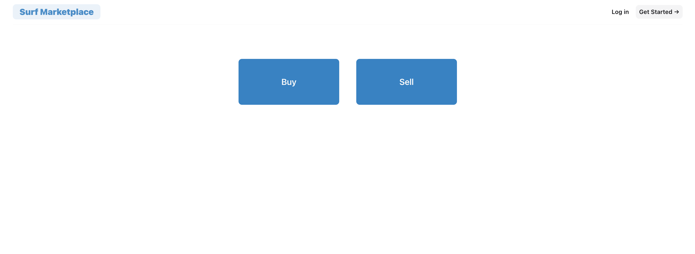

# Surf Marketplace

  
  

## Prensentation

This is a fake marketplace for buying & selling used surfboards. It is basic and kind of empty.

The interesting part is the `/admin/analytics` page, with an admin dashboard listing all the connected users (liveview processes):

- process PID
- RAM usage of the process (updated in real-time)
- liveview assigns (updated in real-time)
- ability to kill a process
- ability to send a message to the user through flash messages & message passing

## Talk

This is the demo of my talk **Real-time Product Analytics with LiveView** at **ElixirConfEU 2023** in Lisbon 🇵🇹

Slides of my talk are [available here](https://slides.com/basilenouvellet/palette/fullscreen)

## Disclaimer

This is an experimental project to explore the idea that, with LiveView, a user is a process.

It is **not** production ready, performance optimizations have not been considered yet (e.g. currently we poll the processes twice a second).

## Contributing

Feel free to open a PR if you think about something to improve.

## Setup

- install dependencies with `mix setup`
- start app with `iex -S mix phx.server`
- visit [`localhost:4000`](http://localhost:4000)
